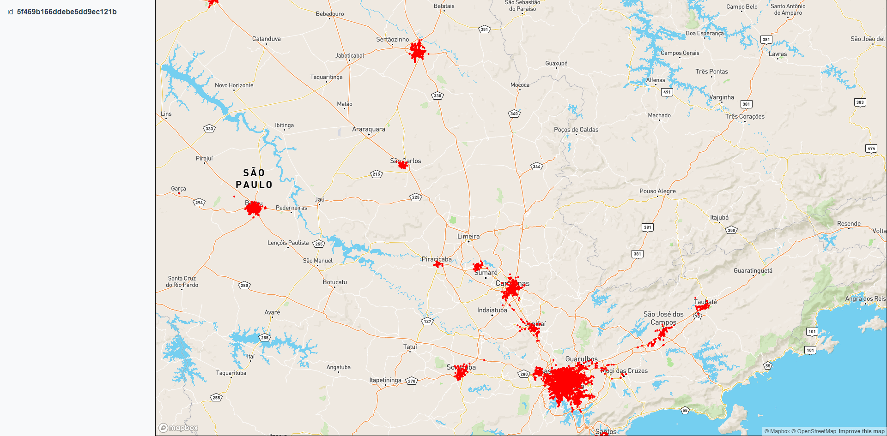

# mapbox-vue-starter-project



## Highlights
- Project uses Polyfill.io instead Babel for reduced output size
- Project uses Mapbox GL npm module + Mapbox GL stylesheet also from its module (instead pointing to Mapbox CDN)
- Basic view (`Home.vue`) with a Mapbox map being loaded through Vue's lifecycle
- Mapbox object (`map`) is outside the view model to reduce Vue's observables and listeners
- A GeoJSON data source is loaded directly with `map.addSource()` - you should have an API or an URL that outputs a `FeatureCollection` with the following model:
```
{ 
  type: 'FeatureCollection',
  features: [
    {
      type: 'Feature',
      geometry: {
        type: 'Point',
        coordinates: [ longitude, latitude ]
      },
      properties: {
        id: 'unique & required'
      }
    }
  ]
}
```
- A simple layer of red circles is loaded for the data source
- A simple `click` event is triggered whenever the user clicks a marker, then it shows the marker detail

## Project setup
```
npm install
```


### Compiles and hot-reloads for development
```
npm run serve
```

### Compiles and minifies for production
```
npm run build
```

### Customize configuration
See [Configuration Reference](https://cli.vuejs.org/config/).
